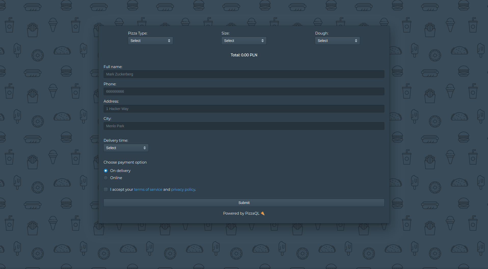
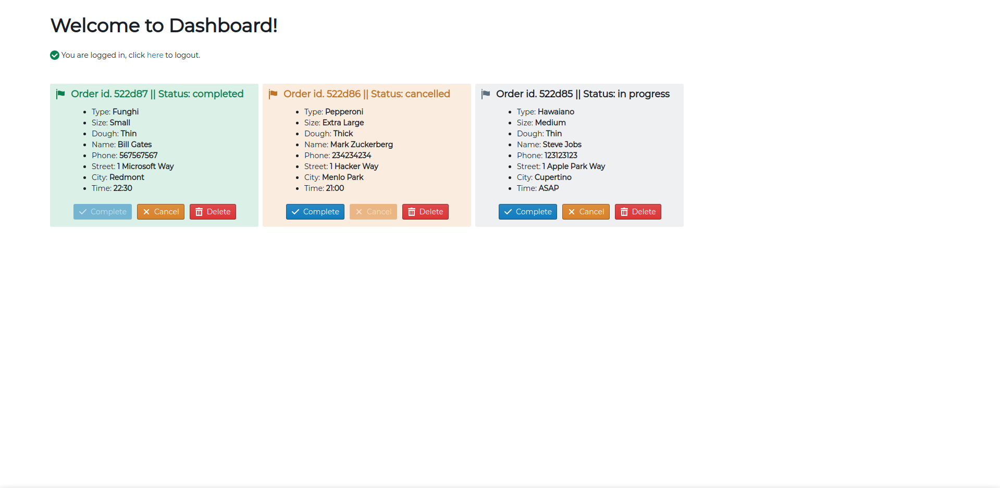

# 

> Modern OSS Order Management System for Pizza Restaurants.

  
  

## Goal

The goal of this project is to provide a modern and easy to use order management system with order placement form as well. You can track progress in our TODO list :smile: 

More information coming soon. Please note that this project is currently **work in progress** and you shouldn't use it in production!

## Docs

[Here :zap:](https://docs.pizzaql.tech/)

## Screenshots

[See more screenshots](https://github.com/pizzaql/pizzaql/tree/master/media/screenshots)

## TODO

**Order Placement System**
* [x]  Basic Frontend
  * [x] Production-ready Frontend (styles etc.)
* [x]  Working Backend
  * [x] Creating orders
    * [x] Rewrite to Apollo Client
    * [x] Use HTML5 form validation wherever possible
    * [x] Implement prices
    * [x] Online payments via Stripe
* [x] Better delivery time selection
    * [x] Rewrite to date-fns
    * [x] Display delivery time based on current hour
* [ ] Thank you page
    * [x] Ability to copy order id
    * [x] Display simplified order id
    * [ ] Show time left to order delivery

**Order Management System**

* [x] Login
  * [x] Full security with Auth0
* [x]  Basic Frontend
  * [x] Listing orders
    * [ ] **Rewrite to GraphQL Subscriptions (work in progress, requires custom resolver)**
  * [x] Ability to change order status
  * [x] Ability to delete orders
    * [x] Confirmation alert
  * [ ] Ability to manually add orders
  * [ ] Production-ready Frontend (styles etc.)
* [x]  Working Backend

**Documentation**

* [x] Guides
  * [x] Development
  * [x] Production
  * [ ] Security
  * [ ] Deployment

**Other**

* [x] Testing with Cypress.io
* [x] Move from Prisma Cloud to Docker
* [ ] Integration with Algolia Places API (?)
* [ ] Release a public demo

(?) - unsure.

## Technology Stack

**Frontend:**

- [React](https://reactjs.org/)
- [Next.js](https://nextjs.org/)
- [Apollo Client](https://github.com/apollographql/apollo-client)
- [styled-components](https://www.styled-components.com/)
- [Blueprint](https://blueprintjs.com/)
- [Formik](https://jaredpalmer.com/formik/)

**Backend:**

- [Prisma](https://www.prisma.io/)
- [GraphQL](https://graphql.org/)
- [MongoDB](https://www.mongodb.com/)
- [Auth0](https://auth0.com/)

## Big Thanks

  

## License

MIT
